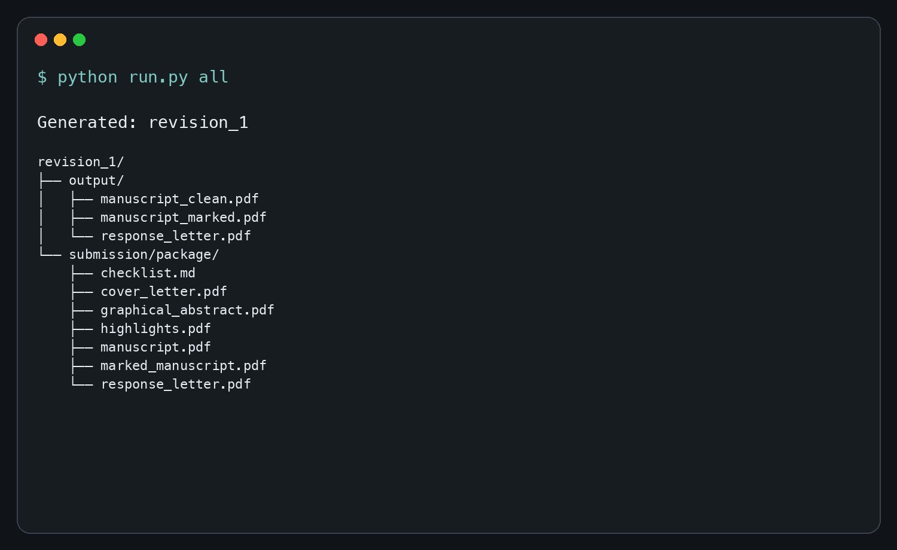
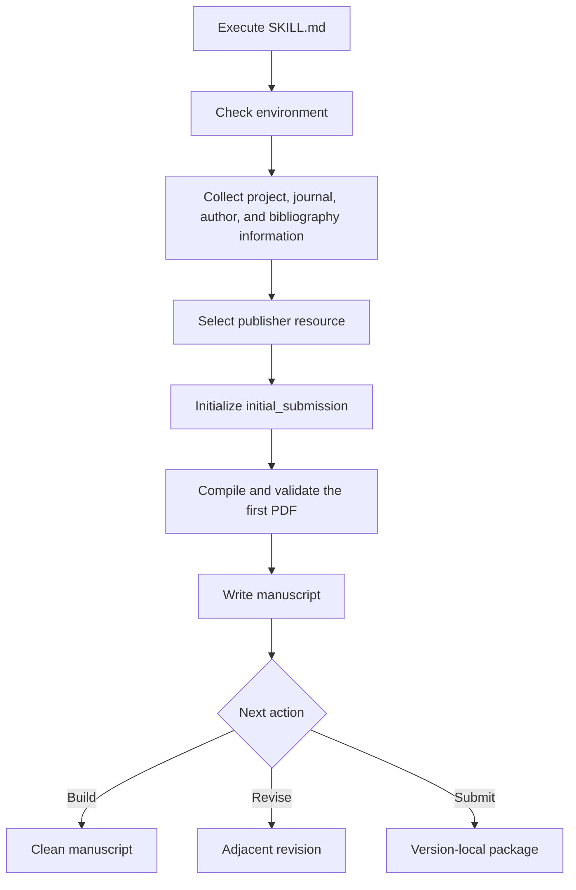
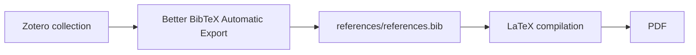
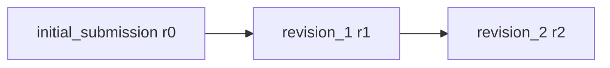
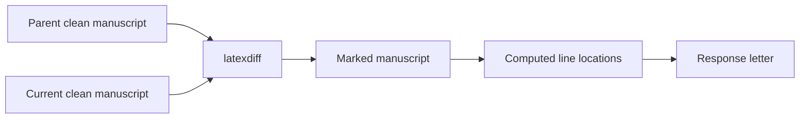
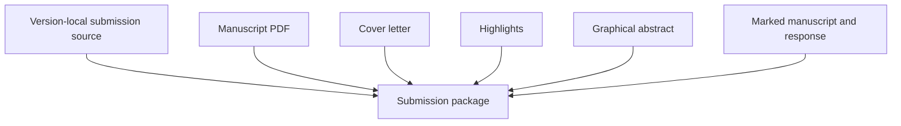

# sci-manuscript-skill

## 1. Purpose

`sci-manuscript-skill` is an agent-operated workflow for managing the complete
LaTeX manuscript lifecycle: initial drafting, first submission, adjacent
revisions, reviewer responses, marked manuscripts, and version-specific
submission packages. It gives every paper a predictable structure and one
project command-line entrypoint while keeping author metadata, bibliography,
response material, and final PDFs synchronized.

The project is designed to solve engineering problems around manuscript work:
unstructured LaTeX folders, ambiguous revision ancestry, duplicated author
information, fragile `latexdiff` commands, scattered response letters, and
time-consuming submission packaging. It does **not** generate scientific
content, invent results, rewrite claims without instruction, judge reviewer
comments, or replace the current instructions of a target journal. Authors
remain responsible for the research, text, data, figures, citations, ethics,
and submission decisions.

## 2. Features

| Feature | Description |
| --- | --- |
| Agent workflow | `SKILL.md` defines environment inspection, information collection, initialization, validation, and handoff |
| Installable runtime | Ships the lifecycle implementation, templates, and publisher resources in one wheel/sdist |
| Portable projects | Generated projects depend on the installed package, not on a source checkout or initialization path |
| Manuscript lifecycle | Maintains initial submission and any number of adjacent revisions |
| Publisher resources | Bundles Elsevier, Springer Nature, ACS, and a general Chinese-journal category |
| Dynamic metadata | Generates publisher-specific LaTeX author commands from one manuscript-level YAML author library |
| Revision comparison | Produces clean and marked manuscripts from adjacent versions with `latexdiff` |
| Response letter | Supports Editor, Associate Editor, and multiple Reviewer blocks while validating unfinished placeholders |
| Safe migration | Upgrades recognized generated wrappers and project metadata without changing manuscript content |
| Submission packaging | Builds cover letter, highlights, graphical abstract, manuscript, response, and checklist artifacts on demand |
| Zotero workflow | Recommends Better BibTeX Automatic Export to the one shared bibliography without controlling Zotero |
| Citation validation | Reports manuscript citation keys missing from the shared BibTeX database without modifying sources |
| Isolated builds | Routes compiler intermediates through `tmp/` and removes successful temporary runs |
| PDF verification | Uses Poppler text extraction and rendering tools for output QA |

## 3. Actual output

The images below come from an anonymous test fixture compiled by the public API.
They contain no unpublished research content or local filesystem paths.

| Marked manuscript | Response letter |
| --- | --- |
|  |  |



## 4. Installation

### Runtime requirements

- Python 3.11 or newer;
- PyYAML 6.x;
- Tectonic, or a supported TeX Live toolchain with `latexmk` and pdfLaTeX or
  XeLaTeX;
- `latexdiff`;
- Poppler tools `pdftotext` and `pdftoppm`;
- a bibliography backend: Tectonic's integrated BibTeX processing, BibTeX, or
  Biber.

Ruff and Mypy are development-only tools. Zotero Better BibTeX is an optional
desktop integration. The recommended workflow uses its Automatic Export, but
the skill never opens Zotero, changes its settings, or accesses its database.

The project is not currently published on PyPI. Install a built wheel for
normal use:

```bash
python -m pip install /path/to/sci_manuscript_skill-4.0.0-py3-none-any.whl
```

For source development, clone the repository and install the package together
with its development-only quality tools:

```bash
git clone https://github.com/cigit-zgy/sci-manuscript-skill.git
cd sci-manuscript-skill

python3 -m venv .venv
source .venv/bin/activate
python -m pip install -e ".[dev]"
```

On macOS with Homebrew, the supported compact toolchain is:

```bash
brew install tectonic latexdiff poppler
```

TeX Live may be used instead when `latexmk` and a compatible LaTeX engine are
available. Chinese projects require XeLaTeX-compatible compilation and usable
Chinese fonts. Always inspect the selected environment after installation:

```bash
sci-manuscript doctor
# equivalent
python -m sci_manuscript doctor
```

`doctor` is read-only. A `READY` result means all required workflow categories
were found. A `BLOCKED` result lists missing requirements and exits with status
2; it never installs or upgrades anything.

## 5. Quick Start

The preferred interface is to ask an agent to execute the skill entrypoint:

```text
Execute /absolute/path/to/sci-manuscript-skill/SKILL.md.
```

The agent follows this sequence:



If a required dependency is missing, the agent reports it and asks before any
environment change. Once the environment is ready, provide a new project path,
manuscript title, target journal, publisher category, language, author YAML,
author order, and optional BibTeX file. If no author or bibliography file is
available, the agent can copy explicit examples only after confirming that
they must be replaced.

The equivalent direct initialization command is:

```bash
sci-manuscript init \
  --project /absolute/path/to/my-paper \
  --title "Manuscript title" \
  --journal "Target Journal" \
  --publisher elsevier \
  --language en \
  --authors /absolute/path/to/authors.yaml \
  --author "First Author" \
  --author "Corresponding Author" \
  --bib /absolute/path/to/references.bib
```

Initialization creates and compiles `initial_submission` (internal round r0).
Continue from the generated project root:

```bash
cd /absolute/path/to/my-paper
python run.py build
python run.py check
python run.py submission
python run.py status
```

The generated project `run.py` imports the installed `sci_manuscript` package.
It records neither the source checkout nor the original project location. The
source repository can therefore be moved, renamed, or deleted, and the complete
manuscript directory can be moved to a path containing spaces or Unicode while
the workflow continues to operate. This is source-checkout independence, not a
fully standalone bundle: the selected Python environment must still contain the
package and the required LaTeX, `latexdiff`, Poppler, and bibliography tools.

## 6. Command line

Every generated project contains a thin `run.py` wrapper. The three supported
forms below enter the same CLI, Public API, workflow, and packaged runtime:

```bash
cd /path/to/manuscript
python run.py build

sci-manuscript build --project /path/to/manuscript
python -m sci_manuscript build --project /path/to/manuscript
```

The first form selects the directory containing `run.py`; the other two require
an explicit project when run elsewhere.

| Command | Purpose |
| --- | --- |
| `doctor` | Inspect required and optional environment dependencies without installing anything |
| `init` | Create `initial_submission` (r0), generate metadata, and compile the first manuscript PDF |
| `build` | Compile the selected version's clean manuscript |
| `revision` | Create the next adjacent revision and initialize its response source |
| `submission` | Build version-local submission materials and package |
| `all` | Build clean, marked, response, and submission outputs for the selected version |
| `setup-zotero` | Prepare the Better BibTeX Automatic Export guide and shared export target |
| `check` | Report citation keys absent from the shared BibTeX database |
| `sync-bib` | Atomically replace the shared BibTeX database from an explicit export as a manual fallback |
| `status` | Report lifecycle ancestry and generated artifacts |
| `upgrade-project` | Safely upgrade recognized generated infrastructure to the current project format |

Run `python run.py <command> --help` for command-specific options. `build`,
`submission`, and `all` accept `--round rN` for an existing version.
`revision` accepts reviewer comments as Markdown through `--reviews`. The
`--allow-placeholders` option is diagnostic only; a package containing pending
responses is not submission-ready.

Compatibility aliases are `render` for `build`, `revise` for `revision`,
`package` for `submission`, and `validation` for `check`. They are visible in
`python run.py --help` and preserve the canonical command behavior.

`submission` and `all` print every final artifact actually produced, including
clean, marked, response, cover-letter, highlights, graphical-abstract, checklist,
and package paths when enabled. Paths are project-relative; compiler staging and
temporary files are never presented as deliverables.

`upgrade-project` is a no-op for a current project, upgrades only recognized
legacy wrappers and workflow metadata, refuses customized wrappers and future
format versions, and never changes manuscript prose, sections, figures, tables,
bibliography, author data, response text, or editable submission sources.

## 7. Python API

The installable `sci_manuscript` package is the stable programmatic interface.
CLI commands and Python calls use the same lifecycle implementation; modules in
`sci_manuscript._runtime` remain private implementation details.

```python
from sci_manuscript import ManuscriptProject, initialize_manuscript

initialized = initialize_manuscript(
    path="/absolute/path/to/my-paper",
    title="Anonymous manuscript title",
    journal="Target Journal",
    publisher="elsevier",
    language="en",
    authors="/absolute/path/to/authors.yaml",
    selected_authors=("First Author", "Corresponding Author"),
    bib="/absolute/path/to/references.bib",
)

project = ManuscriptProject(initialized.project)
status = project.status()
build = project.build()
revision = project.start_revision(reviews="/absolute/path/to/reviews.md")
# The author completes the generated response source before packaging.
submission = project.prepare_submission()
same_submission_workflow = project.build_all()  # convenience alias
upgrade = project.upgrade_project()
```

All operations return frozen dataclass results containing `Path` objects for
final artifacts. They do not expose `argparse.Namespace` or compiler, diff,
metadata-rendering, and temporary-file internals.

| CLI | Python API |
| --- | --- |
| `run.py doctor` | `project.doctor()` |
| `run.py init ...` | `initialize_manuscript(...)` |
| `run.py status` | `project.status()` |
| `run.py build` | `project.build()` |
| `run.py revision` | `project.start_revision(reviews=...)` |
| `run.py submission` | `project.prepare_submission()` |
| `run.py all` | `project.build_all()` |
| `run.py check` | `project.check()` |
| `run.py setup-zotero` | `project.setup_zotero()` |
| `run.py sync-bib` | `project.sync_bib(...)` |
| `run.py upgrade-project` | `project.upgrade_project()` |

`build_all()` is the convenience alias for `prepare_submission()`; both follow
one implementation and return the same artifact model. Public calls return
typed, frozen result dataclasses and raise `ManuscriptError` for workflow
failures. `__version__` comes from installed distribution metadata. The package
also includes `py.typed` for type-checking consumers. Low-level flattening,
`latexdiff`, metadata rendering, compiler staging, and response-parser helpers
are deliberately not public API.

## 8. User configuration

### `manuscript.yaml`

Each version owns one `manuscript.yaml` containing title, article type,
language, journal, selected publisher template, semantic revision identity,
immediate parent, project-format compatibility, submission switches, and author
role groups. It does not duplicate emails or affiliations. Revision creation
copies this YAML from the direct parent, preserves the format version, and
changes only the adjacent revision identity.

```yaml
workflow:
  format_version: 1
  created_with: 4.0.0

manuscript:
  title: Manuscript title
  article_type: Research Paper
  language: en

journal:
  name: Target Journal
  publisher: elsevier
  template: elsarticle

revision:
  name: initial_submission
  parent: null
  round: r0

submission:
  cover_letter: true
  highlights: true
  graphical_abstract: true

authors:
  first_authors:
    - First Author
    - Co-first Author
  corresponding_authors:
    - Corresponding Author
    - Co-corresponding Author
  authors:
    - Other Author
```

`workflow.format_version` identifies the on-disk project contract independently
from the installed package version. `created_with` records the package version
that initialized or last migrated this format metadata. A newer unsupported
format is never silently downgraded; use `upgrade-project` for a recognized
older generated project.

### `references/authors.yaml`

This manuscript-level author library stores complete English and Chinese
names, default roles, affiliation references, affiliation addresses, and known
email addresses. Email is optional for ordinary authors but required for every
author selected as corresponding. The names selected in each version's
`manuscript.yaml` must exactly match keys in this file. Multiple first and
corresponding authors are supported. Python expands the selected version and shared library into
`references/author_metadata.tex` and `references/publisher_metadata.tex`.
Manuscript and correspondence templates use these generated shared sources;
do not edit them directly.

### `references/references.bib`

This is the only bibliography used by every version. Prefer Zotero Better
BibTeX Automatic Export as described below. When Automatic Export is
unavailable, atomically replace it from an explicit export using the manual
fallback:

```bash
python run.py sync-bib --bib-export /absolute/path/to/export.bib
```

### `sections/`, `figures/`, and `tables/`

Publisher-specific section files are structural placeholders. Replace all
placeholder prose with author-written content. The figures and tables
directories start empty; add only manuscript assets. The workflow does not
create scientific figures or infer missing content.

## 9. Project structure

```text
manuscript/
├── run.py
├── references/                   # manuscript-level shared resources
│   ├── authors.yaml
│   ├── author_metadata.tex       # generated
│   ├── publisher_metadata.tex    # generated
│   ├── references.bib
│   ├── revision_style.tex
│   ├── zotero_setup.md
│   └── journal_templates/
│       ├── elsevier/
│       ├── nature/
│       ├── acs/
│       └── chinese/
├── initial_submission/          # r0, parent null
│   ├── manuscript.yaml
│   ├── manuscript.tex
│   ├── preamble.tex
│   ├── sections/
│   ├── figures/
│   ├── tables/
│   ├── submission/              # editable sources populated on demand
│   └── output/
├── revision_1/                  # r1, parent r0
│   └── response/
│       ├── reviewer_comments.md
│       └── response_letter.tex
├── revision_2/                  # r2, parent r1
└── tmp/
```

`initial_submission` is the complete first-submission state. Each
`revision_N` is copied only from `revision_(N-1)` (or from
`initial_submission` for revision 1) and adds its own response source,
submission material, and outputs. Editable submission sources and response
attachments are inherited, while the previous round's response letter and
generated package are excluded. Revision directories never contain a
`references/` directory. `tmp/` contains isolated
compiler and diff work and is empty after successful commands. Manuscript
sources, outputs, and submission files never live directly at the project
root. Shared author data, bibliography, revision style, and all publisher
classes exist exactly once under root `references/`. Workflow execution uses
the installed Python package.

Two similarly named concepts have distinct scopes. Package resources under
`src/sci_manuscript/resources/` are software-distribution inputs bundled in the
wheel. Project `references/` contains the one manuscript-level copy shared by
all rounds. No revision owns a private bibliography, author library, revision
style, or publisher class.

## 10. Zotero and bibliography workflow

The recommended bibliography workflow is Zotero Better BibTeX Automatic
Export. It keeps the BibTeX database current while leaving LaTeX with one
explicit, reproducible input:



1. Install the Zotero Better BibTeX extension.
2. Export the manuscript collection using format **Better BibTeX**.
3. Choose the exact export path shown in `references/zotero_setup.md`.
4. Enable **Keep updated**.
5. Run `python run.py check`, then build normally.

`python run.py setup-zotero` recreates a missing bibliography target and setup
guide. It does **not** open Zotero, change Zotero settings, access the Zotero
database, or call a Zotero API. Builds never synchronize the bibliography
implicitly. `sync-bib` remains an explicit manual fallback.

## 11. Publisher templates

| Publisher key | Bundled resource | Intended use |
| --- | --- | --- |
| `elsevier` | `elsarticle` | Elsevier article workflow |
| `nature` | Springer Nature `sn-jnl` | Generic Springer Nature authoring resource |
| `acs` | `achemso` | ACS article workflow |
| `chinese` | `kxtbcas` | General Chinese-journal starting point |

The `nature` key does not claim a dedicated official class for every Nature
Portfolio journal. The `chinese` category is not a universal official Chinese
journal template. Publisher resources and default section mappings live in
`src/sci_manuscript/resources/journal_templates/<publisher>/`; initialization
copies the selected files into project `references/`. Each resource README
records its source, version, date, license, and any local compatibility
adaptation.

Bundled resources are tested with author, figure, citation, and bibliography
content, but journals update instructions independently. Check the current
Guide for Authors and update the selected resource when necessary. Upstream
templates retain their own licenses; see `THIRD_PARTY_NOTICES.md`.

## 12. Revision workflow

The revision boundary is a machine-checked contract, not agent-facing prose
only. `references/revision_contract.yaml` in this repository and the identical
packaged resource `src/sci_manuscript/resources/revision_contract.yaml` declare
the default permission `no_content_edit`; the runtime loads and validates the
packaged copy every time a revision is started, so revision infrastructure
creation fails fast if the installed package ever shipped a weakened contract.

The ancestry is explicit and gap-free:



Create the next version with:

```bash
python run.py revision --reviews /absolute/path/to/reviewer-comments.md
```

The command rejects r0-to-r2 jumps and copies manuscript state only from the
immediate parent; it never copies or regenerates the shared references tree.
Starting a revision does not authorize or perform a manuscript edit, and the
parent source hash remains unchanged. Reviewer comments alone never authorize
the agent to decide or draft replacement text; an exact patch or concrete edit
operation must be supplied or explicitly confirmed by the user.
Reviewer-linked additions use `\review{1-1}{Revised text.}`; author-initiated
additions use `\selfadd{Additional text.}`. The marked manuscript compares the
current version against its direct parent, so added and deleted text remain
traceable. User-adjustable colors and markup appearance are isolated in
`references/revision_style.tex`.

### Response input and stable IDs

Reviewer input is Markdown with explicit correspondence headings and
consecutive numbered comments within each block:

```markdown
# Editor

1. Please clarify the scope and retain A_B at 10%.

   This is a second paragraph of the same editor comment.

# Associate Editor

1. Please address x & y.

# Reviewer #1

General assessment without a numbered response item.

1. First numbered comment.
2. Second numbered comment.

# Reviewer #2

1. Another reviewer comment.
```

Numbered items receive stable IDs `E-1`, `AE-1`, `1-1`, `1-2`, and `2-1`.
Existing numeric reviewer IDs remain unchanged, and block order never silently
renumbers a reviewer. Blank-line-separated comment paragraphs are retained.
Reviewer text is external data and is safely escaped for LaTeX, including
`&`, `%`, `$`, `#`, `_`, braces, backslashes, `~`, and `^`. The generated
`\ResponsePending{...}` remains editable LaTeX owned by the author and is not
double-escaped or scientifically completed by the workflow.

Manuscript provenance may use `\review{E-1}{...}`,
`\review{AE-1}{...}`, or an existing numeric reviewer ID. A missing linked
change is reported as `Location unavailable`; the workflow never invents a line
number. Pending responses from any supported block stop `submission` and `all`
unless `--allow-placeholders` is explicitly used for diagnostics.



Complete each `\ResponsePending{review-id}` in the version-local response
letter, then run `python run.py all`. A revision package contains the clean
manuscript, marked manuscript, response letter, cover letter, highlights,
graphical abstract, and checklist according to the YAML submission switches.
Manuscript PDFs have continuous line numbers; correspondence and supplementary
submission files do not.



## 13. Validation and development

The repository separates agent routing, deterministic execution, on-demand
guidance, static output resources, and the two validation layers:

| Directory | Purpose |
| --- | --- |
| `SKILL.md` | Agent routing, authorization boundaries, and workflow invariants |
| `src/sci_manuscript/` | Public API, thin CLI, private deterministic runtime, typing marker, and authoritative package resources |
| `scripts/` | Thin source-checkout compatibility and development entrypoints only; no duplicate runtime implementation |
| `references/` | Agent-readable environment and lifecycle guidance loaded only when needed |
| `docs/` | Public documentation images and supporting material |
| `evals/` | Agent triggering, routing, authorization, and scope-boundary evaluations |
| `tests/` | Software correctness, package integrity, lifecycle invariants, portability, and publisher validation |

`SKILL.md` is intentionally a compact router. A normal `build` does not require
the environment reference, and publisher `.cls`, `.bst`, and `.dtx` files are
package resources rather than routine agent context. `evals/` defines behavioral
specifications; it is not presented as an independent LLM evaluation harness.
`tests/` is the executable software verification suite.

Run the release checks from the repository root:

```bash
pytest
ruff format --check .
ruff check .
mypy src scripts tests
python -m build
```

Release validation additionally installs the wheel and sdist into fresh isolated
environments outside the repository, audits packaged templates and licenses,
exercises a fresh r0 -> r1 -> r2 lifecycle, moves a project between Unicode and
space-containing paths, and verifies source hashes and temporary-file cleanup.
With the local LaTeX toolchain installed, the release gate also performs real
publisher compilation, PDF text extraction, page rendering, line-number checks,
and marked-manuscript overflow inspection. Development tools are optional for
manuscript users but required before publishing changes.

`.github/workflows/test.yml` runs Pytest, Ruff format/check, Mypy, package build,
and installed-wheel import/resource smoke checks on pushes and pull requests.
It does not claim the complete local PDF release gate when a full TeX toolchain
is unavailable in CI.

### Stable architecture boundaries

Version 4.0 establishes backward-compatibility expectations for the Public
API, three CLI entry forms, project directory model, adjacent revision ancestry,
root-only shared references, response ID scheme, package-resource model, project
format version, and no-content-edit contract. Future development should prefer
bug fixes, publisher upstream-resource updates, and compatibility maintenance
over directory, API, or workflow redesign.

## 14. License

Original workflow code, documentation, tests, and original templates are
released under the MIT License in `LICENSE`. Bundled publisher class and
bibliography resources are third-party works and retain their upstream terms.
The maintainer-provided Chinese class is documented separately because its
source did not include an embedded license notice; the maintainer has confirmed
that it may be distributed publicly with the project. Review
`THIRD_PARTY_NOTICES.md` and each publisher-resource README before
redistribution.
