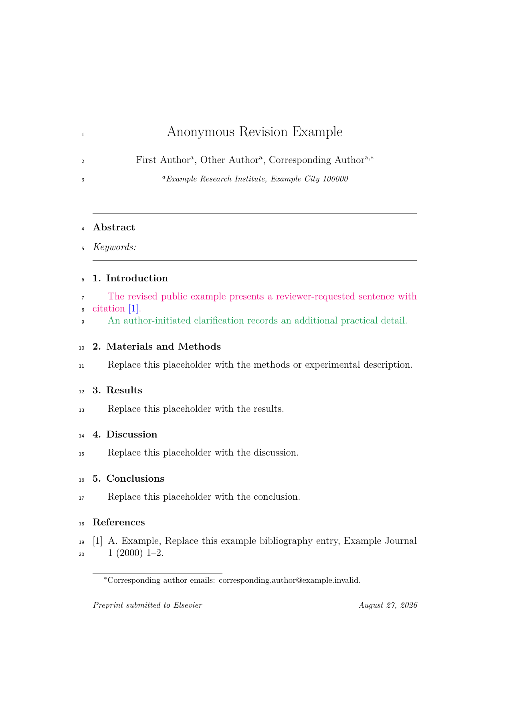
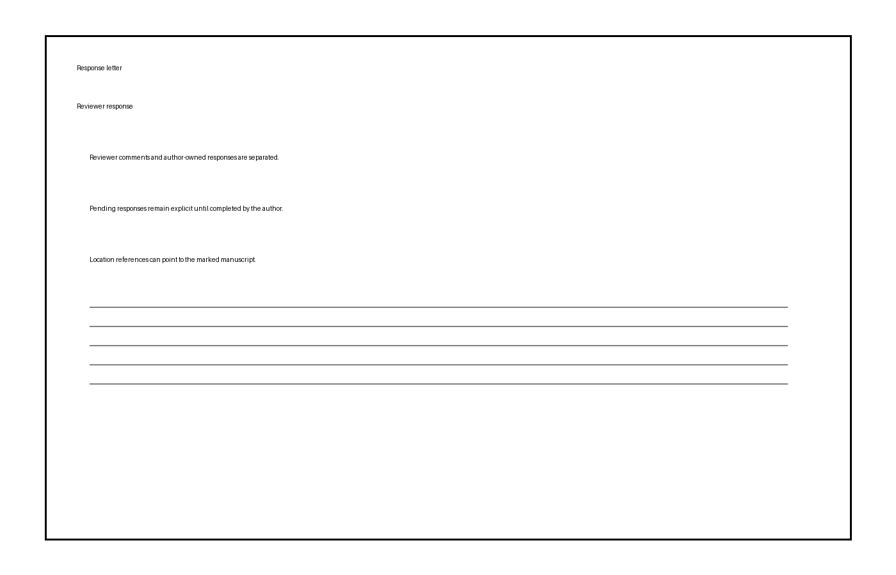
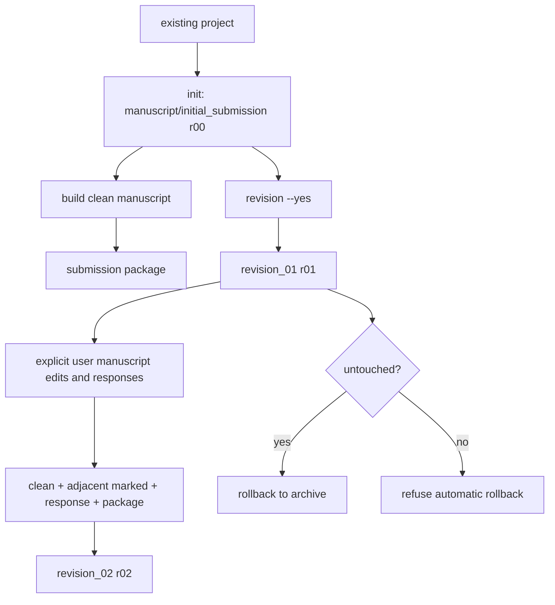

# sci-manuscript-skill

An installable Python workflow for reproducible LaTeX manuscript lifecycle
engineering. It initializes a manuscript workspace, compiles four bundled
publisher formats, creates adjacent revisions, generates marked manuscripts and
response letters with line locations, and assembles version-local submission
packages. It never writes scientific prose or decides how to answer reviewers.

## Real E2E output

The images below are equal-size renders from the anonymous test lifecycle, not
mockups. The marked-manuscript contract is: ordinary author additions detected
by latexdiff use a blue wave underline, deletions use red strikeout, and
reviewer-linked text uses a green straight underline.

| Marked manuscript | Response letter with location |
| --- | --- |
|  |  |

## Features

- Elsevier `elsarticle`, Springer Nature `sn-jnl`, ACS `achemso`, and a general
  Chinese-journal `kxtbcas` resource.
- One installed CLI and one Python API backed by the same implementation.
- Reusable user-level, role-free author profiles and shared `references.bib`.
- Fixed `r00`, `r01`, `r02` identities with adjacent `latexdiff` only.
- Safe rollback for untouched newest revisions and transactional reindexing.
- Editor/reviewer response IDs, response status validation, and line locations.
- Clean-versus-marked overfull-box regression QA with a durable layout report.
- Version-local cover letter, highlights, graphical abstract, and package.
- Lazy `tmp/` creation and successful-run cleanup.

## Installation

Python 3.11+, PyYAML, a LaTeX toolchain, `latexdiff`, and Poppler are required.
Tectonic is the preferred compact engine; traditional mode uses `latexmk` and
XeLaTeX for Chinese manuscripts.

```bash
git clone https://github.com/cigit-zgy/sci-manuscript-skill.git
cd sci-manuscript-skill
python -m pip install .
sci-manuscript doctor
```

For development:

```bash
python -m pip install -e ".[dev]"
```

## Author library

Configure the reusable, role-free author profiles once, then select manuscript
roles independently for each paper:

```bash
sci-manuscript authors configure ~/authors.yaml
sci-manuscript authors list
sci-manuscript authors show author_one
sci-manuscript init --project /path/to/existing-project
```

`init --authors PATH` overrides the configured user library for that run. On
macOS the configured copy is stored under
`~/Library/Application Support/sci-manuscript/authors.yaml`. If neither source
exists, the package's public, role-free five-person team library is used. The
priority is explicit path, configured user library, then bundled library. A
validated copy is placed in `manuscript/references/authors.yaml`; init still
requires explicit first, corresponding, and other role selection and never
selects every bundled author automatically.

## Quick start

The parent project may already contain unrelated files. Only an existing
`PROJECT/manuscript/` blocks initialization.

```bash
sci-manuscript init \
  --project /path/to/existing-project \
  --title "Manuscript title" \
  --journal "Target Journal" \
  --publisher elsevier \
  --language en \
  --article-type "Research Article" \
  --first-author first_author \
  --corresponding-author corresponding_author

sci-manuscript status --project /path/to/existing-project
sci-manuscript build --project /path/to/existing-project
sci-manuscript revision --project /path/to/existing-project \
  --reviews /path/to/reviewer_comments.md --yes
sci-manuscript submission --project /path/to/existing-project
```

If author flags are omitted in an interactive terminal, `init` lists every
author ID with Chinese and English names and asks separately for first,
corresponding, and other authors. It never selects everyone implicitly.

## Workflow



## CLI

| Command | Behavior |
| --- | --- |
| `doctor` | Read-only dependency report |
| `authors configure/list/show` | Manage reusable user-level author profiles |
| `init` | Create and compile `PROJECT/manuscript/initial_submission` |
| `status` | Show latest round, parent, metadata, and final artifacts |
| `build` | Compile one clean manuscript without changing sources |
| `revision` | Confirm and create exactly the next adjacent revision |
| `rollback` | Archive an untouched newest revision; refuse edited sources |
| `reindex` | Transactionally close revision-number gaps |
| `submission` | Build clean/marked/response artifacts and fail marked-only overflow |
| `sync-bib` | Atomically replace the single shared bibliography |

Use `sci-manuscript <command> --help` for options. The CLI catches workflow
errors and prints `ERROR: ...` without exposing an implementation traceback.

## Python API

```python
from sci_manuscript import ManuscriptProject, initialize_manuscript

initialize_manuscript(
    "/path/to/existing-project",
    title="Manuscript title",
    journal="Target Journal",
    publisher="elsevier",
    language="en",
    article_type="Research Article",
    first_authors=("author_one",),
    corresponding_authors=("author_one",),
)

project = ManuscriptProject("/path/to/existing-project")
status = project.status()
clean = project.build()
revision = project.start_revision(reviews="reviews.md", confirmed=True)
package = project.prepare_submission()
```

The API returns frozen structured results with final artifact `Path` objects.
`build_all()` is a compatibility alias for `prepare_submission()`.

## Project structure

```text
existing-project/
└── manuscript/
    ├── 00_archive/
    ├── references/
    │   ├── authors.yaml
    │   ├── references.bib
    │   └── revision_style.tex
    ├── initial_submission/
    │   ├── meta.yaml
    │   ├── manuscript.tex
    │   ├── sections/
    │   ├── figures/
    │   ├── tables/
    │   ├── output/
    │   └── submission/
    └── revision_01/
        ├── meta.yaml
        ├── revision_creation.yaml
        ├── manuscript.tex
        ├── sections/
        ├── figures/
        ├── tables/
        ├── response/
        │   ├── reviewer_comments.md
        │   └── responses.tex
        ├── output/
        └── submission/
            └── cover_letter_body.tex
```

No project-local `run.py` is created. Built-in publisher classes and generated
metadata are staged from installed package resources inside a temporary build,
so the user workspace stays small. A custom publisher alone creates
`references/journal_template/`. `tmp/` is created only during work and removed
after success.

Reviewer comments remain authoritative in `response/reviewer_comments.md`;
users edit only `response/responses.tex` and `submission/cover_letter_body.tex`.
Complete response and cover-letter TeX documents are assembled in `tmp/` from
the installed package correspondence templates during submission builds.
Revision submission also publishes `output/revision_layout_qa.txt`; a marked
overflow not present in the clean compiler log fails the entire workflow.
Visual inspection of the marked PDF remains required for small shared warnings.

### Migrating a legacy workspace

The current on-disk contract uses `meta.yaml`, fixed-width revision names,
role-free author IDs, and an outer `manuscript/` directory. Legacy development
workspaces are not mutated automatically. Preserve the original as a read-only
source, initialize a current workspace beside it, convert the author library and
each round's metadata, then copy user-owned manuscript/section/figure/table/
response content without copying generated output, old `run.py`, or publisher
templates. Place a dated snapshot under `00_archive/` before switching. This
explicit migration is preferred to an unsafe heuristic conversion of scientific
work.

## Configuration

`references/authors.yaml` is a role-free manuscript-level library:

```yaml
affiliations:
  institute:
    name_en: Anonymous Research Institute, Example City, Country
    name_zh: 示例研究机构
authors:
  author_one:
    name_zh: 匿名作者
    name_en: Anonymous Author
    email: author@example.invalid
    affiliations: [institute]
```

An affiliation's `name_en` is the complete submission string and may include
both the institution and address. `name_zh` stores the Chinese institution name;
new author libraries should not split the address into a separate field.

Each round's `meta.yaml` selects roles independently. Overlap is valid, so one
author can be both first and corresponding author:

```yaml
revision:
  round: r00
  name: initial_submission
  parent: null
manuscript:
  title: Manuscript title
  language: en
  article_type: Research Article
journal:
  name: Target Journal
  publisher: elsevier
authors:
  first_author: [author_one]
  corresponding_author: [author_one]
  other_author: []
correspondence:
  manuscript_id: null
  editor_name: null
  editor_title: null
  signing_author: null
```

Python resolves both files and generates publisher metadata only in the isolated
build stage. A sole corresponding author signs correspondence automatically.
With multiple corresponding authors, `correspondence.signing_author` must name
one of them before submission. User TeX and YAML remain authoritative.

Cover and response sources are created once and are never overwritten by later
builds. The editable cover template intentionally includes gray
`\guidance{...}` prompts; every prompt and unresolved `%%TOKEN%%` must be replaced
or removed before submission packaging. English and Chinese correspondence
templates are self-contained; Chinese correspondence uses XeLaTeX and xeCJK.

## Revision and response

Only explicit user edits are permitted. Mark additions with:

```latex
\review{1-1}{reviewer-linked text}
\review{1-1,2-3}{text linked to multiple comments}
\review{E-1}{editor-linked text}
```

The visual semantics are fixed and mutually exclusive:

| Meaning | Color | Line style | Source |
| --- | --- | --- | --- |
| Ordinary addition not linked to a comment | Blue `(0,92,153)` | Wave underline | adjacent `latexdiff` |
| Deletion | Red `(220,45,45)` | Strikeout | adjacent `latexdiff` |
| Reviewer/editor-linked addition | Green `(0,135,90)` | Straight underline | `\review{IDs}{...}` |

Ordinary author additions need no wrapper. `\user{...}` remains accepted only
for backward compatibility and renders with the same ordinary blue-wave style.
Do not use `\review` merely to recolor an ordinary edit: its IDs drive response
coverage and marked-manuscript line locations. Mathematics follows the same
color semantics; deleted formulae use a zero-width red strike overlay, while
text line decorators never scan mathematical content.

Deletions need no wrapper; adjacent `latexdiff` detects them. A new revision
removes inherited `\review`/`\user` wrappers while preserving their text.

Reviewer input supports explicit status:

```text
# Editor

## E-1 | response_only

Please clarify the scope.

# Reviewer #1

## 1-1 | manuscript_revised

Please revise the sentence.
```

`manuscript_revised` requires its ID in at least one `\review`. Pending response
macros block submission unless the diagnostic-only `--allow-placeholders` is
explicitly supplied. The response source displays only IDs supplied by
`reviewer_comments.md`: it has no independent LaTeX numbering counter.
`manuscript_revised` entries receive real marked-manuscript line locations;
`response_only` entries omit location output.

`revision_creation.yaml` hashes protected user sources. Rollback is allowed only
while that digest is unchanged. Reindex first copies all affected revisions to
`00_archive/`, stages renumbered versions, checks scientific-source hashes, and
atomically swaps directories; any failure restores the original layout.

## Publisher resources and licenses

Runtime resources live once under `src/sci_manuscript/resources/` and are packed
into the wheel. Upstream classes retain their original notices. The Chinese
resource is a maintainer-provided general Chinese-journal starting point, not a
claim of universal official status. See [THIRD_PARTY_NOTICES.md](THIRD_PARTY_NOTICES.md).

## Development and release gates

```bash
python -m compileall -q src tests
pytest
ruff format --check .
ruff check .
mypy src tests
python -m build
```

Release validation also installs the wheel in a clean environment, audits
package resources, compiles all four publishers, runs an anonymous
`r00 -> r01 -> r02` PDF lifecycle, checks rollback/reindex safety and temporary
cleanup, verifies blue ordinary-addition/red deletion/green reviewer provenance
with zero
marked-PDF overfull boxes, inspects rendered pages, and verifies the two README
screenshots have identical dimensions. GitHub Actions keeps a fast Linux quality
job and a macOS integration-release job with the real Tectonic/latexdiff/Poppler
toolchain.

## License

Original code and documentation are released under the MIT License. Third-party
publisher resources are governed by their upstream terms.
